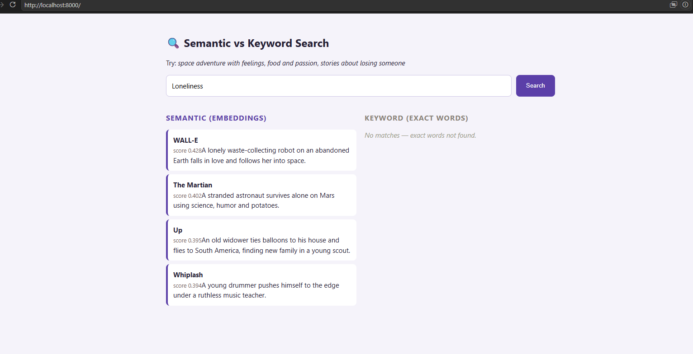
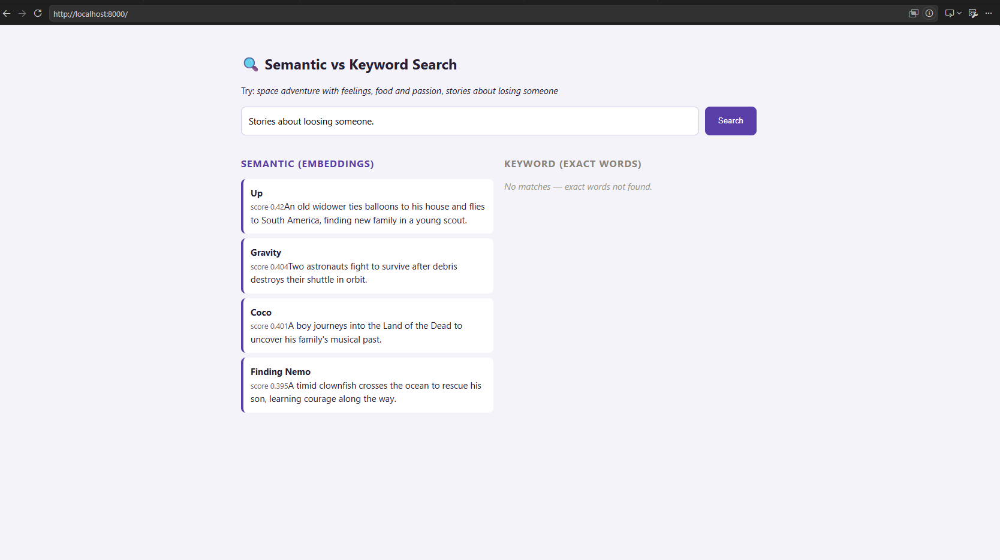
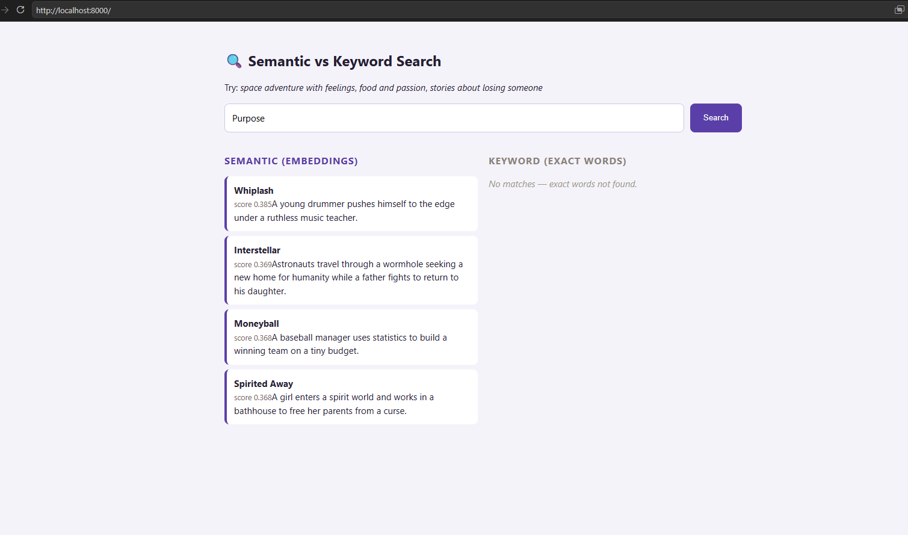

# Semantic Search vs Keyword Search

A tiny full-stack app that searches a movie catalog **two ways at once** —
classic keyword matching and embedding-based semantic search — and shows the
results side by side so the difference is obvious.

Try searching **`space adventure with feelings`**: keyword search finds almost
nothing (those exact words aren't in any description), while semantic search
correctly surfaces *Interstellar*, *WALL-E*, and *Gravity* because it matches on
**meaning**, not literal words.

---

## What it teaches

| Concept | Where it shows up |
|---|---|
| Embeddings (text → vectors) | OpenAI `text-embedding-3-small` via ChromaDB |
| Vector database & indexing | Movies embedded and stored at startup |
| Nearest-neighbor retrieval | Chroma returns the 4 closest vectors to your query |
| Distance → similarity score | `1 / (1 + distance)` for display |
| Why semantic beats keyword | Side-by-side comparison with a naive keyword baseline |

---

## How it works

1. **Index (once, at startup):** twelve `"title: description"` strings are sent
   to OpenAI's embedding model, which turns each into a vector capturing its
   meaning. The vectors are stored in an in-memory ChromaDB collection.
2. **Query (per search):**
   - *Semantic* — your query is embedded with the same model; Chroma returns the
     4 movies whose vectors are closest, with a distance per result that's
     converted to a 0–1 similarity score.
   - *Keyword* — a hand-written baseline lowercases your query, splits it into
     words, and counts how many appear in each movie's text. No matching words
     means no result.
3. **Display:** both result sets render in two columns in the browser.

---

## Project structure

```
04-semantic-search/
├── main.py            # FastAPI backend: indexing + both search methods
├── requirements.txt   # Python dependencies
├── .env.example       # Template for your API key
└── static/
    └── index.html     # Frontend UI (served by the backend)
```

---

## Requirements

- **Python 3.10+** — check with `python --version`
- **An OpenAI API key** with a little billing credit — needed because the
  embeddings are generated by OpenAI. Cost is negligible (fractions of a cent;
  it only embeds 12 short descriptions plus your query).

---

## Setup & run

Run these from inside the `04-semantic-search/` folder.

**1. Create and activate a virtual environment**

```bash
python -m venv .venv
```

| OS / shell | Activate command |
|---|---|
| Windows (cmd) | `.venv\Scripts\activate` |
| Windows (PowerShell) | `.venv\Scripts\Activate.ps1` |
| Mac / Linux | `source .venv/bin/activate` |

You'll see `(.venv)` at the start of your prompt when it's active.

**2. Install dependencies**

```bash
pip install -r requirements.txt
```

**3. Add your API key**

```bash
# Windows
copy .env.example .env
# Mac / Linux
cp .env.example .env
```

Open `.env` and replace the placeholder with your real key
(get one at https://platform.openai.com/api-keys):

```
OPENAI_API_KEY=sk-...your-real-key...
```

**4. Start the server**

```bash
python main.py
```

Wait for the line saying it's running on port `8000`. The first run takes a few
extra seconds while it embeds the catalog.

**5. Open the app**

Go to **http://localhost:8000** in your browser.

> ⚠️ Do **not** visit `http://0.0.0.0:8000` — that's the address the server
> *listens on*, not one a browser can open. Use `localhost` or `127.0.0.1`.

**6. Stop the server**

Press `Ctrl+C` in the terminal.

---

## Things to try

- `space adventure with feelings` — semantic wins big over keyword
- `food and passion` — surfaces *Ratatouille* without the word "food" matching
- `stories about losing someone` — finds emotional themes, not literal words
- A plain title like `Coco` — keyword matches it directly; compare the columns

---

## Troubleshooting

| Symptom | Cause & fix |
|---|---|
| `ERR_ADDRESS_INVALID` in browser | You opened `0.0.0.0:8000`. Use `http://localhost:8000`. |
| `401` / `AuthenticationError` | Key in `.env` is missing or mistyped; confirm `.env` sits next to `main.py`. |
| `insufficient_quota` (429) | Add billing credit to your OpenAI account. |
| `python` not recognized (Windows) | Python isn't on PATH — try `py main.py`, or reinstall Python with "Add to PATH" ticked. |
| Port already in use | Another server is running — `Ctrl+C` it, or change `port=8000` to `8001` at the bottom of `main.py`. |
| Slow first search | Normal — embedding the catalog happens on first run. |

---

## Notes

- The catalog is hardcoded in `main.py` — add your own `(title, description)`
  tuples to the `MOVIES` list to search a different dataset.
- The keyword search is deliberately naive (exact word counting) to make the
  contrast with semantic search clear; it is not a tuned baseline.
- Model names and pricing change over time. If `text-embedding-3-small` is ever
  deprecated, check https://platform.openai.com/docs/models for a current one.


  <p align="center">
  
</p>


<p align="center">
  
</p>


<p align="center">
  
</p>
