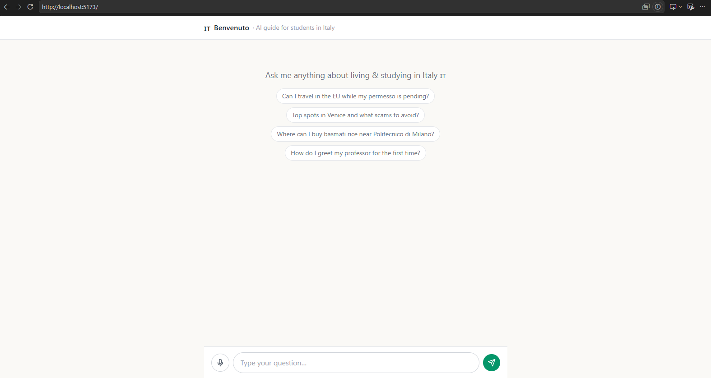
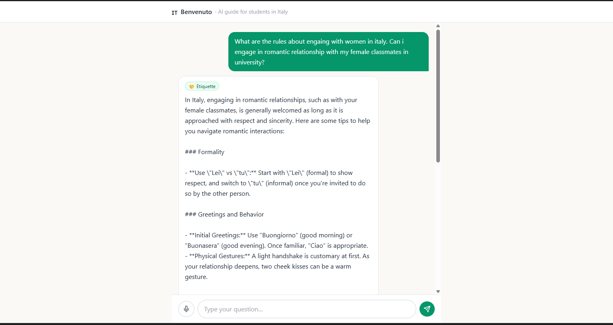

# 🇮🇹 Benvenuto — An Agentic AI Guide for International Students in Italy

> Your AI companion for studying and living in Italy. Ask it anything — visa rules, what's safe to eat where, how *not* to get scammed at a tourist spot, what to say to a shopkeeper, where to buy that one ingredient from home, or which scholarships open next month — and it figures out which expert "tool" to use, gathers real data, and answers in plain language (or out loud, in Italian, so you can practice).

Built as an **agentic system**: a single orchestrator LLM that reasons about your question and calls one or more specialized tools, each backed by real data sources (RAG knowledge bases, OpenStreetMap, live news feeds, web search). Everything is free and open-source **except** the OpenAI API.

---

## Table of Contents

1. [What it does](#1-what-it-does)
2. [The eight tools](#2-the-eight-tools)
3. [Architecture](#3-architecture)
4. [OpenAI models — and exactly what each one is for](#4-openai-models--and-exactly-what-each-one-is-for)
5. [Tech stack (all free / open-source)](#5-tech-stack-all-free--open-source)
6. [Repository structure](#6-repository-structure)
7. [Prerequisites](#7-prerequisites)
8. [Step-by-step setup](#8-step-by-step-setup)
9. [How the agent works (the orchestration loop)](#9-how-the-agent-works-the-orchestration-loop)
10. [Tool implementation walkthroughs](#10-tool-implementation-walkthroughs)
11. [The frontend](#11-the-frontend)
12. [Running everything](#12-running-everything)
13. [API reference](#13-api-reference)
14. [Cost & rate-limit notes](#14-cost--rate-limit-notes)
15. [Safety, disclaimers & responsible use](#15-safety-disclaimers--responsible-use)
16. [Roadmap / stretch goals](#16-roadmap--stretch-goals)
17. [Troubleshooting](#17-troubleshooting)
18. [License](#18-license)

---

## 1. What it does

A new international student in Italy has a hundred small questions and no single place to ask them. **Benvenuto** is that single place. You type (or speak) a question; the agent decides which specialist tool answers it best, pulls live or curated data, and replies — with sources, cautions, and optional spoken Italian.

Example questions it handles end-to-end:

- *"My permesso di soggiorno appointment is in 3 weeks — am I allowed to travel within the EU before I get the card?"* → **Law tool**
- *"Anything important happening this month that affects foreign students in Italy?"* → **News tool**
- *"What's a typical breakfast in Bologna and what should I never order after noon?"* → **Cuisine tool**
- *"I'm visiting Venice for a weekend — top spots and what tourist traps to dodge?"* → **Tourism tool**
- *"How do I greet my professor vs. a classmate? Teach me the phrases out loud."* → **Etiquette tool** (with TTS)
- *"Where near Politecnico di Milano can I buy basmati rice and spices?"* → **Grocery tool**
- *"What's around Sapienza University in Rome — pharmacy, supermarket, metro?"* → **University-area tool**
- *"Any scholarships or internships opening soon for international students at University of Padua?"* → **Scholarship tool**

---

## 2. The eight tools

| # | Tool | What it answers | Primary data source(s) | Type |
|---|------|------------------|------------------------|------|
| 1 | `law_info` | Italian laws & rules for a situation/activity (immigration, residence, work hours for students, renting, ZTL driving zones, etc.) | Curated RAG corpus + web search fallback | RAG + web |
| 2 | `student_news` | News a foreign student should actually know (visa rule changes, strikes/*scioperi*, university deadlines, public-health notices) | RSS feeds (ANSA EN, The Local Italy, university feeds) + web search | Live feeds |
| 3 | `cuisine_guide` | Regional dishes, food etiquette, what to eat/avoid, ordering tips, menu photo translation | Curated RAG corpus + vision for menu photos | RAG + vision |
| 4 | `tourism_guide` | Top spots in a region **plus** specific scams/traps to avoid | Wikivoyage API + curated "traps" corpus + web search | API + RAG |
| 5 | `etiquette_coach` | What to say & how to behave to socialize (greetings, formality, gestures), with spoken Italian | Curated phrasebook corpus + `tts-1` audio | RAG + TTS |
| 6 | `grocery_finder` | Where to buy a specific item/ingredient near a location | OpenStreetMap Overpass + web search | Geo + web |
| 7 | `university_area` | Everything around a given Italian university — transport, supermarkets, pharmacies, banks, student services | OpenStreetMap Nominatim + Overpass | Geo |
| 8 | `scholarships` | Scholarship & internship opportunities for international students at a specific university | RSS/career-portal feeds + curated DSU/EU corpus + web search | Live feeds + RAG |

Three patterns repeat across these tools, and the README treats each as a reusable building block:

- **RAG tools** (1, 3, 4, 5, 8): curated documents → chunked → embedded with `text-embedding-3-small` → stored in **ChromaDB** → retrieved per query.
- **Geo tools** (6, 7): geocode a place name with **Nominatim**, query nearby amenities with **Overpass**.
- **Live tools** (2, 8): pull and rank fresh items from **RSS feeds** + optional web search.

---

## 3. Architecture

```
                         ┌─────────────────────────────────────────────┐
                         │                FRONTEND                      │
                         │   React + Vite + Tailwind                    │
                         │   • chat UI  • voice button  • tool badges   │
                         └───────────────────┬─────────────────────────┘
                                             │  POST /chat  (SSE stream)
                                             ▼
            ┌────────────────────────────────────────────────────────────────┐
            │                       BACKEND  (FastAPI)                         │
            │                                                                  │
            │   1. omni-moderation  ──►  block unsafe input                    │
            │              │                                                   │
            │              ▼                                                   │
            │   2. ORCHESTRATOR AGENT  (gpt-4o + function calling)             │
            │        "Which tool(s) answer this? With what arguments?"         │
            │              │                                                   │
            │     ┌────────┴──────────────────────────────────────────┐       │
            │     ▼        ▼        ▼        ▼        ▼        ▼   ...   │       │
            │  law_info  news  cuisine  tourism  etiquette  grocery ... │       │
            │     │        │        │        │        │        │        │      │
            │     ▼        ▼        ▼        ▼        ▼        ▼         │      │
            │  ChromaDB   RSS    Chroma+  Wikivoyage  Chroma  Overpass  │      │
            │  (RAG)     feeds   vision   + traps     + TTS   + web      │      │
            │     └────────┴────────┴───── tool results ─────┴──────────┘      │
            │              │                                                   │
            │              ▼                                                   │
            │   3. SYNTHESIS  (gpt-4o)  ──►  grounded answer + citations       │
            │              │                                                   │
            │              ▼                                                   │
            │   4. optional tts-1  ──►  spoken Italian audio                   │
            └────────────────────────────────────────────────────────────────┘

   Shared services:  OpenAI client • ChromaDB (persisted) • OSM (Nominatim/Overpass)
                     • feedparser • DuckDuckGo search • Whisper (voice in) • Vision (photos)
```

**Flow in one sentence:** moderate → the agent picks tools via OpenAI function calling → tools fetch real data → the agent synthesizes a grounded answer → optionally speaks it.

---

## 4. OpenAI models — and exactly what each one is for

The brief asked to use the full OpenAI model lineup. Each model is mapped to a job where it genuinely earns its place, not just for the sake of inclusion:

| Model | Role in Benvenuto | Why this model |
|-------|-------------------|----------------|
| `gpt-4o` | **Orchestrator** (tool selection via function calling) + **final synthesis** | Strong multi-step reasoning and reliable tool-argument formatting |
| `gpt-4o-mini` | **Per-tool summarization** & query rewriting (e.g. compress 20 RSS items → 5 relevant ones) | 15–20× cheaper; perfect for high-volume, lower-stakes steps |
| `text-embedding-3-small` | **Embeddings** for every RAG tool's ChromaDB collections | Cheap, fast, great recall for retrieval |
| `whisper-1` | **Voice input** — student speaks a question instead of typing | Robust multilingual speech-to-text (handles accented English/Italian) |
| `tts-1` / `tts-1-hd` | **Voice output** — speaks answers and, crucially, **pronounces Italian phrases** in the etiquette tool | Natural speech; `hd` for the pronunciation feature |
| `gpt-4o` (vision) | **Image understanding** — translate a menu photo, read a rental contract clause, identify a grocery product | Single model does text + vision; no extra dependency |
| `omni-moderation-latest` | **Safety gate** on inputs and outputs | Free, fast, blocks abuse/unsafe content before it hits the agent |
| `dall-e-3` *(optional)* | Generate a simple visual guide (e.g. "what a permesso di soggiorno looks like") | Optional UX nicety; off by default to save cost |

All model names live in one config file so you can swap or upgrade them in one place.

---

## 5. Tech stack (all free / open-source)

**Backend**
- **FastAPI** — async Python web framework, SSE streaming
- **Uvicorn** — ASGI server
- **ChromaDB** — local, persistent vector database (no cloud, no key)
- **feedparser** — RSS parsing for news & scholarships
- **httpx** — async HTTP for OSM / web calls
- **ddgs** (DuckDuckGo Search) — free web search, **no API key**
- **pydantic** — request/response schemas
- **python-dotenv** — env management

**Frontend**
- **React + Vite** — fast dev server & build
- **Tailwind CSS** — styling
- **lucide-react** — icons

**Free external data (no paid keys)**
- **OpenStreetMap** — Nominatim (geocoding) + Overpass (nearby amenities)
- **Wikivoyage API** — traveler info & "stay safe" sections
- **RSS feeds** — ANSA English, The Local Italy, university news/career portals
- **DuckDuckGo** — web search fallback

> The **only** paid dependency is the OpenAI API. Everything else runs locally and free.
> Optional upgrades: **Tavily** (better search, free tier + key) or self-hosted **SearXNG** (fully free, fully open-source) as a drop-in for DuckDuckGo.

---

## 6. Repository structure

```
benvenuto/
├── backend/
│   ├── app/
│   │   ├── main.py               # FastAPI app + /chat SSE endpoint
│   │   ├── config.py             # all settings & model names (single source of truth)
│   │   ├── models.py             # pydantic request/response schemas
│   │   ├── llm.py                # OpenAI wrappers: chat, embed, whisper, tts, vision, moderation
│   │   ├── agent.py              # orchestrator loop (function-calling)
│   │   ├── tools/
│   │   │   ├── __init__.py        # TOOL_REGISTRY + OpenAI function schemas
│   │   │   ├── law.py
│   │   │   ├── news.py
│   │   │   ├── cuisine.py
│   │   │   ├── tourism.py
│   │   │   ├── etiquette.py
│   │   │   ├── grocery.py
│   │   │   ├── university_area.py
│   │   │   └── scholarships.py
│   │   ├── rag/
│   │   │   ├── store.py           # ChromaDB wrapper (get/add/query)
│   │   │   └── ingest.py          # chunk + embed + seed collections
│   │   └── services/
│   │       ├── osm.py             # Nominatim + Overpass helpers
│   │       ├── websearch.py       # DuckDuckGo wrapper
│   │       └── feeds.py           # RSS fetch + parse
│   ├── data/                      # curated source docs (markdown/txt)
│   │   ├── law/                   #   e.g. permesso_di_soggiorno.md, student_work_rules.md
│   │   ├── cuisine/               #   e.g. regional_dishes.md, food_etiquette.md
│   │   ├── tourism_traps/         #   e.g. venice_scams.md, rome_taxi_scams.md
│   │   ├── etiquette/             #   e.g. greetings.md, formality_lei_tu.md
│   │   └── scholarships/          #   e.g. dsu_regional.md, eu_programs.md
│   ├── chroma_db/                 # persisted vectors  (gitignored)
│   ├── requirements.txt
│   └── .env.example
├── frontend/
│   ├── src/
│   │   ├── main.jsx
│   │   ├── App.jsx
│   │   ├── api.js                 # SSE client for /chat
│   │   └── components/
│   │       ├── Chat.jsx
│   │       ├── Message.jsx
│   │       ├── ToolBadge.jsx      # shows which tool answered
│   │       └── VoiceButton.jsx    # records mic → Whisper
│   ├── index.html
│   ├── package.json
│   ├── tailwind.config.js
│   └── vite.config.js
├── docker-compose.yml             # optional one-command run
├── .gitignore
└── README.md
```

---

## 7. Prerequisites

- **Python 3.10+**
- **Node.js 18+** and npm
- An **OpenAI API key** → https://platform.openai.com/api-keys
- ~200 MB disk for ChromaDB + dependencies
- (Optional) Docker, if you want the one-command path

---

## 8. Step-by-step setup

### Step 1 — Clone and enter

```bash
git clone https://github.com/<your-username>/benvenuto.git
cd benvenuto
```

### Step 2 — Backend: virtual environment + dependencies

```bash
cd backend
python3 -m venv .venv
source .venv/bin/activate        # Windows: .venv\Scripts\activate
pip install -r requirements.txt
```

`requirements.txt`:

```txt
fastapi
uvicorn[standard]
openai>=1.40
chromadb
feedparser
httpx
ddgs
pydantic
python-dotenv
python-multipart        # for audio file uploads (Whisper)
```

### Step 3 — Configure environment

```bash
cp .env.example .env
```

`.env.example`:

```dotenv
# ---- OpenAI ----
OPENAI_API_KEY=sk-your-key-here

# ---- Model map (change here, nowhere else) ----
MODEL_ORCHESTRATOR=gpt-4o
MODEL_SUMMARIZER=gpt-4o-mini
MODEL_EMBED=text-embedding-3-small
MODEL_WHISPER=whisper-1
MODEL_TTS=tts-1
MODEL_VISION=gpt-4o
MODEL_MODERATION=omni-moderation-latest

# ---- App ----
CHROMA_DIR=./chroma_db
OSM_USER_AGENT=benvenuto-student-guide/1.0 (your-email@example.com)
ENABLE_WEB_SEARCH=true
```

> ⚠️ **Never commit `.env`.** Confirm `.env` and `chroma_db/` are in `.gitignore` *before* your first commit. A leaked OpenAI key gets abused within minutes — if it ever lands in a commit, revoke it immediately at platform.openai.com and rotate.

`.gitignore` (project root):

```gitignore
# secrets & local data
.env
backend/chroma_db/
backend/.venv/

# python
__pycache__/
*.pyc

# node
node_modules/
frontend/dist/

# os
.DS_Store
```

### Step 4 — Add your knowledge-base documents

Drop curated markdown/txt files into `backend/data/<topic>/`. Start small — even 5–10 well-written docs per topic make the RAG tools useful. Each file should be focused (one subject per file) so chunks stay coherent. Example `backend/data/law/student_work_rules.md`:

```markdown
# Working hours for non-EU students in Italy

Non-EU students holding a study residence permit (permesso di soggiorno per studio)
may work part-time, up to 20 hours per week, capped at 1,040 hours per year...
(Always verify against the official Questura / Ministero dell'Interno guidance —
this document is informational only.)
```

> Keep an explicit "verify with the official source" line in every law/scholarship doc. The synthesis prompt is also told to add this, but defense-in-depth helps.

### Step 5 — Seed the vector database

This chunks every file in `data/`, embeds it with `text-embedding-3-small`, and writes to ChromaDB. One ChromaDB *collection* per RAG tool.

```bash
python -m app.rag.ingest
```

Expected output:

```
[ingest] law          → 14 chunks embedded
[ingest] cuisine       → 22 chunks embedded
[ingest] tourism_traps → 9  chunks embedded
[ingest] etiquette     → 11 chunks embedded
[ingest] scholarships  → 7  chunks embedded
✅ ChromaDB seeded at ./chroma_db
```

### Step 6 — Run the backend

```bash
uvicorn app.main:app --reload --port 8000
```

Check it's alive: open http://localhost:8000/health → `{"status":"ok"}`.

### Step 7 — Frontend

```bash
cd ../frontend
npm install
npm run dev
```

Open the printed URL (usually http://localhost:5173). Set the backend URL in `frontend/.env`:

```dotenv
VITE_API_BASE=http://localhost:8000
```

You're live. Ask it something.

---

## 9. How the agent works (the orchestration loop)

This is the heart of the project. The orchestrator is a **function-calling loop**: give `gpt-4o` the list of tool schemas, let it decide which to call, run the tool(s), feed results back, repeat until it produces a final answer.

`backend/app/agent.py`:

```python
import json
from app.llm import chat, moderate
from app.tools import TOOL_SCHEMAS, TOOL_REGISTRY
from app.config import settings

SYSTEM_PROMPT = """You are Benvenuto, an AI guide for international students in Italy.
Decide which tool(s) answer the user's question, call them, then write a clear,
friendly answer grounded ONLY in the tool results.

Rules:
- Prefer tools over your own memory for facts, prices, locations, news, and law.
- For legal/official-process answers, always add: "Verify with the official source
  (Questura / Prefettura / your university office) before acting."
- Cite sources the tools return.
- If tools return nothing useful, say so honestly instead of inventing details."""

MAX_STEPS = 5

async def run_agent(user_message: str, history: list[dict]) -> dict:
    # 1) Safety gate
    if await moderate(user_message):
        return {"answer": "I can't help with that request.", "tools_used": []}

    messages = [{"role": "system", "content": SYSTEM_PROMPT}, *history,
                {"role": "user", "content": user_message}]
    tools_used = []

    # 2) Reason → call tools → repeat
    for _ in range(MAX_STEPS):
        resp = await chat(
            model=settings.MODEL_ORCHESTRATOR,
            messages=messages,
            tools=TOOL_SCHEMAS,
            tool_choice="auto",
        )
        msg = resp.choices[0].message
        messages.append(msg.model_dump(exclude_none=True))

        if not msg.tool_calls:
            return {"answer": msg.content, "tools_used": tools_used}

        # 3) Execute each requested tool
        for call in msg.tool_calls:
            name = call.function.name
            args = json.loads(call.function.arguments or "{}")
            tools_used.append(name)
            try:
                result = await TOOL_REGISTRY[name](**args)
            except Exception as e:
                result = {"error": str(e)}
            messages.append({
                "role": "tool",
                "tool_call_id": call.id,
                "content": json.dumps(result)[:8000],   # keep context bounded
            })

    # 4) Fallback if the loop maxes out
    final = await chat(model=settings.MODEL_ORCHESTRATOR, messages=messages)
    return {"answer": final.choices[0].message.content, "tools_used": tools_used}
```

**Why a hand-rolled loop instead of a framework?** You see and control every step — moderation, the cap on tool calls, context truncation, error handling per tool. For learning agentic engineering (and for debugging in production) that transparency is worth more than the convenience of LangChain/LlamaIndex. You can always wrap it in **LangGraph** later if you want explicit state-machine control.

### Tool schemas (function-calling definitions)

`backend/app/tools/__init__.py` registers each tool's callable **and** its JSON schema. Example for two tools:

```python
from app.tools.law import law_info
from app.tools.university_area import university_area
# ... import the rest

TOOL_REGISTRY = {
    "law_info": law_info,
    "university_area": university_area,
    # ...
}

TOOL_SCHEMAS = [
    {
        "type": "function",
        "function": {
            "name": "law_info",
            "description": "Italian laws, rules, and official procedures for a "
                           "specific activity or situation (immigration, residence "
                           "permits, student work hours, renting, driving/ZTL, etc.)",
            "parameters": {
                "type": "object",
                "properties": {
                    "topic": {"type": "string",
                              "description": "The legal topic or situation, e.g. "
                                             "'travel within EU while permesso pending'"},
                    "region": {"type": "string",
                               "description": "Optional Italian region/city for local rules"}
                },
                "required": ["topic"],
            },
        },
    },
    {
        "type": "function",
        "function": {
            "name": "university_area",
            "description": "Practical info about the area around a specific Italian "
                           "university: transport, supermarkets, pharmacies, banks, "
                           "student services, cafés.",
            "parameters": {
                "type": "object",
                "properties": {
                    "university": {"type": "string",
                                   "description": "University name, e.g. "
                                                  "'Politecnico di Milano'"},
                    "categories": {"type": "array", "items": {"type": "string"},
                                   "description": "Amenity types to focus on, e.g. "
                                                  "['pharmacy','supermarket','metro']"}
                },
                "required": ["university"],
            },
        },
    },
    # ... schemas 3–8
]
```

---

## 10. Tool implementation walkthroughs

Two representative tools — one **RAG** tool and one **geo** tool — show the patterns the others reuse.

### 10.1 RAG pattern — `law_info`

`backend/app/rag/store.py`:

```python
import chromadb
from app.llm import embed
from app.config import settings

_client = chromadb.PersistentClient(path=settings.CHROMA_DIR)

def collection(name: str):
    return _client.get_or_create_collection(name)

async def query(collection_name: str, text: str, k: int = 4) -> list[str]:
    vec = await embed(text)                       # text-embedding-3-small
    coll = collection(collection_name)
    res = coll.query(query_embeddings=[vec], n_results=k)
    return res["documents"][0] if res["documents"] else []
```

`backend/app/tools/law.py`:

```python
from app.rag.store import query
from app.services.websearch import web_search
from app.llm import summarize
from app.config import settings

async def law_info(topic: str, region: str | None = None) -> dict:
    q = f"{topic} {region or ''}".strip()

    # 1) Retrieve from the curated legal corpus
    docs = await query("law", q, k=4)

    # 2) If the corpus is thin, fall back to live web search
    web = []
    if settings.ENABLE_WEB_SEARCH and len("".join(docs)) < 400:
        web = await web_search(f"Italy {q} rules official site:*.gov.it OR site:*.it")

    # 3) gpt-4o-mini compresses everything into a tight, sourced brief
    context = "\n\n".join(docs + [w["snippet"] for w in web])
    brief = await summarize(
        instruction=(
            "Summarize the Italian rules for the student's situation in 4-6 bullet "
            "points. Be precise about numbers/limits. End with a one-line reminder "
            "to verify with the official authority. Do NOT invent specifics."
        ),
        context=context,
    )
    return {
        "topic": topic,
        "brief": brief,
        "sources": [{"type": "kb"} for _ in docs] + [{"type": "web", **w} for w in web],
        "disclaimer": "Informational only — not legal advice. Verify with the Questura/Prefettura.",
    }
```

The other RAG tools (`cuisine_guide`, `tourism_guide`, `etiquette_coach`, `scholarships`) are the **same shape** — swap the collection name, the web-search query, and the summarizer instruction. `tourism_guide` additionally calls the Wikivoyage API and merges a dedicated `tourism_traps` collection so scam warnings are always surfaced. `etiquette_coach` additionally returns a `tts_phrases` list that the backend turns into audio (see 10.3).

### 10.2 Geo pattern — `university_area`

`backend/app/services/osm.py`:

```python
import httpx
from app.config import settings

HEADERS = {"User-Agent": settings.OSM_USER_AGENT}   # Nominatim REQUIRES this

async def geocode(place: str) -> tuple[float, float] | None:
    url = "https://nominatim.openstreetmap.org/search"
    params = {"q": place, "format": "json", "limit": 1, "countrycodes": "it"}
    async with httpx.AsyncClient(headers=HEADERS, timeout=20) as c:
        r = await c.get(url, params=params)
        data = r.json()
    if not data:
        return None
    return float(data[0]["lat"]), float(data[0]["lon"])

async def nearby(lat: float, lon: float, amenities: list[str], radius_m: int = 1000):
    # Build an Overpass QL query for the requested amenity types
    filters = "".join(
        f'node["amenity"="{a}"](around:{radius_m},{lat},{lon});'
        f'node["shop"="{a}"](around:{radius_m},{lat},{lon});'
        for a in amenities
    )
    q = f"[out:json][timeout:25];({filters});out body 30;"
    async with httpx.AsyncClient(headers=HEADERS, timeout=40) as c:
        r = await c.post("https://overpass-api.de/api/interpreter", data=q)
    elements = r.json().get("elements", [])
    return [{
        "name": e["tags"].get("name", "Unnamed"),
        "kind": e["tags"].get("amenity") or e["tags"].get("shop"),
        "lat": e["lat"], "lon": e["lon"],
    } for e in elements if "tags" in e]
```

`backend/app/tools/university_area.py`:

```python
from app.services.osm import geocode, nearby

DEFAULT = ["supermarket", "pharmacy", "bank", "cafe", "subway_entrance"]

async def university_area(university: str, categories: list[str] | None = None) -> dict:
    coords = await geocode(university)
    if not coords:
        return {"error": f"Couldn't locate '{university}'. Try a fuller name + city."}
    lat, lon = coords
    places = await nearby(lat, lon, categories or DEFAULT, radius_m=1200)
    return {
        "university": university,
        "center": {"lat": lat, "lon": lon},
        "places": places[:25],
        "map_hint": f"https://www.openstreetmap.org/#map=16/{lat}/{lon}",
    }
```

`grocery_finder` reuses these same two helpers: geocode the area, then `nearby(...)` for `supermarket`/`greengrocer`/`convenience`, plus a web-search pass for the *specific* item ("where to buy basmati rice in Milan").

> **Be a good OpenStreetMap citizen:** Nominatim requires a real `User-Agent` and asks for ≤1 request/second. Cache geocodes (the same university is asked about repeatedly) and, if you scale up, self-host Nominatim/Overpass — both are open-source.

### 10.3 Voice & vision (the OpenAI media models)

`backend/app/llm.py` (excerpt):

```python
from openai import AsyncOpenAI
from app.config import settings

client = AsyncOpenAI(api_key=settings.OPENAI_API_KEY)

async def transcribe(audio_bytes: bytes, filename: str) -> str:        # whisper-1
    return (await client.audio.transcriptions.create(
        model=settings.MODEL_WHISPER, file=(filename, audio_bytes))).text

async def speak(text: str, voice: str = "alloy") -> bytes:             # tts-1
    r = await client.audio.speech.create(
        model=settings.MODEL_TTS, voice=voice, input=text)
    return r.read()

async def describe_image(image_b64: str, prompt: str) -> str:          # gpt-4o vision
    resp = await client.chat.completions.create(
        model=settings.MODEL_VISION,
        messages=[{"role": "user", "content": [
            {"type": "text", "text": prompt},
            {"type": "image_url",
             "image_url": {"url": f"data:image/jpeg;base64,{image_b64}"}},
        ]}])
    return resp.choices[0].message.content
```

These power three nice UX touches:
- **Voice questions** — the mic button records audio, sends it to `/voice`, Whisper transcribes, the agent answers.
- **Menu/document photos** — upload a photo; `cuisine_guide` or `law_info` passes it to vision to translate/explain.
- **Pronounce Italian** — `etiquette_coach` returns phrases; the backend renders each with `tts-1-hd` so you hear correct pronunciation.

---

## 11. The frontend

A minimal React chat that **streams** the answer and shows which tools fired (so the agent's reasoning is visible — great for demos and debugging).

`frontend/src/api.js`:

```javascript
export async function streamChat(message, history, onChunk, onTools) {
  const res = await fetch(`${import.meta.env.VITE_API_BASE}/chat`, {
    method: "POST",
    headers: { "Content-Type": "application/json" },
    body: JSON.stringify({ message, history }),
  });

  const reader = res.body.getReader();
  const decoder = new TextDecoder();

  while (true) {
    const { value, done } = await reader.read();
    if (done) break;
    for (const line of decoder.decode(value).split("\n\n")) {
      if (!line.startsWith("data: ")) continue;
      const evt = JSON.parse(line.slice(6));
      if (evt.type === "tools") onTools(evt.tools);
      if (evt.type === "token") onChunk(evt.text);
    }
  }
}
```

The `ToolBadge` component renders a little chip per tool used (`🏛 law_info`, `📍 university_area`, …) above the answer, so the user sees *how* the agent reached its conclusion.

---

## 12. Running everything

### Manual (two terminals)

```bash
# terminal 1 — backend
cd backend && source .venv/bin/activate
uvicorn app.main:app --reload --port 8000

# terminal 2 — frontend
cd frontend && npm run dev
```

### One command (optional Docker)

`docker-compose.yml`:

```yaml
services:
  backend:
    build: ./backend
    env_file: ./backend/.env
    ports: ["8000:8000"]
    volumes: ["./backend/chroma_db:/app/chroma_db"]
  frontend:
    build: ./frontend
    environment:
      VITE_API_BASE: http://localhost:8000
    ports: ["5173:5173"]
```

```bash
docker compose up --build
```

> Remember to run the ingestion step (`python -m app.rag.ingest`) once so ChromaDB is populated — inside the container or by mounting a pre-built `chroma_db/`.

---

## 13. API reference

| Method | Endpoint | Body | Returns |
|--------|----------|------|---------|
| `GET` | `/health` | — | `{"status":"ok"}` |
| `POST` | `/chat` | `{ message, history }` | **SSE stream** of `tools` + `token` events |
| `POST` | `/voice` | multipart audio file | `{ transcript, answer, tools_used }` |
| `POST` | `/vision` | `{ image_b64, question }` | `{ answer }` |
| `POST` | `/speak` | `{ text, voice }` | `audio/mpeg` bytes |

Example:

```bash
curl -N -X POST http://localhost:8000/chat \
  -H "Content-Type: application/json" \
  -d '{"message":"Top spots in Florence and what scams to avoid?","history":[]}'
```

---

## 14. Cost & rate-limit notes

- **Embeddings are a one-time cost** at ingestion. Re-embedding only happens when you change `data/`. With `text-embedding-3-small`, seeding a few hundred docs costs cents.
- **`gpt-4o-mini` does the heavy lifting** inside tools (summarizing search results, RSS items). Reserve `gpt-4o` for orchestration + final synthesis. This split keeps per-conversation cost low.
- **Cache aggressively:** geocodes, Wikivoyage pages, and RSS pulls change slowly. A simple `functools.lru_cache` (or a tiny SQLite cache) on `geocode()` and feed fetches cuts both latency and API load.
- **OSM etiquette:** keep Nominatim to ≤1 req/sec with a real User-Agent; self-host if you scale.
- Set a **monthly spend limit** in the OpenAI dashboard while developing.

---

## 15. Safety, disclaimers & responsible use

- **Not legal/official advice.** The `law_info` and `scholarships` tools are informational. Every answer in those domains appends a "verify with the official authority" reminder, enforced both in the source docs and the synthesis prompt.
- **Moderation gate.** `omni-moderation-latest` screens inputs (and you can screen outputs too) before anything reaches the agent.
- **Grounded answers only.** The system prompt forbids inventing specifics; if tools return nothing useful, the agent says so rather than hallucinating a deadline or a law.
- **No PII storage.** Don't persist chat history server-side beyond the session unless you add consent + retention controls.
- **Source transparency.** Tool badges + returned `sources` let users verify where each claim came from.

---

## 16. Roadmap / stretch goals

- **Per-user context memory** (their city + university) so they don't re-state it every turn.
- **LangGraph** rewrite of the loop for explicit retries/branching and parallel tool calls.
- **Evaluation harness** — an LLM-as-judge eval set per tool (you've built these before): "did the law tool include the disclaimer?", "did tourism surface at least one trap?".
- **Map rendering** in the frontend (Leaflet + OSM tiles, free) for the geo tools.
- **Offline phrasebook** — pre-generate common etiquette audio so the TTS feature works without a call.
- **Self-hosted SearXNG** to drop the last external search dependency.

---

## 17. Troubleshooting

| Symptom | Likely cause | Fix |
|---------|--------------|-----|
| `chromadb` returns empty results | Collections not seeded | Run `python -m app.rag.ingest` |
| Nominatim returns `403`/empty | Missing/blocked User-Agent | Set a real `OSM_USER_AGENT` with contact info |
| Overpass times out | Public endpoint busy | Retry, lower `radius_m`, or self-host Overpass |
| `openai.AuthenticationError` | Bad/empty key | Check `.env`; key starts with `sk-` |
| Push blocked by GitHub Push Protection | `.env`/key committed | **Revoke the key now**, remove from history, force-push the cleaned branch |
| SSE shows nothing in browser | CORS or wrong `VITE_API_BASE` | Enable CORS in FastAPI; verify the base URL |
| Whisper upload fails | Missing `python-multipart` | `pip install python-multipart` |

---

## 18. License

MIT — free to use, modify, and learn from. Data sources retain their own licenses (OpenStreetMap © OpenStreetMap contributors, ODbL; Wikivoyage under CC BY-SA). Attribute them in any public deployment.

---




*Benvenuto in Italia — in bocca al lupo with your studies. 🇮🇹*
