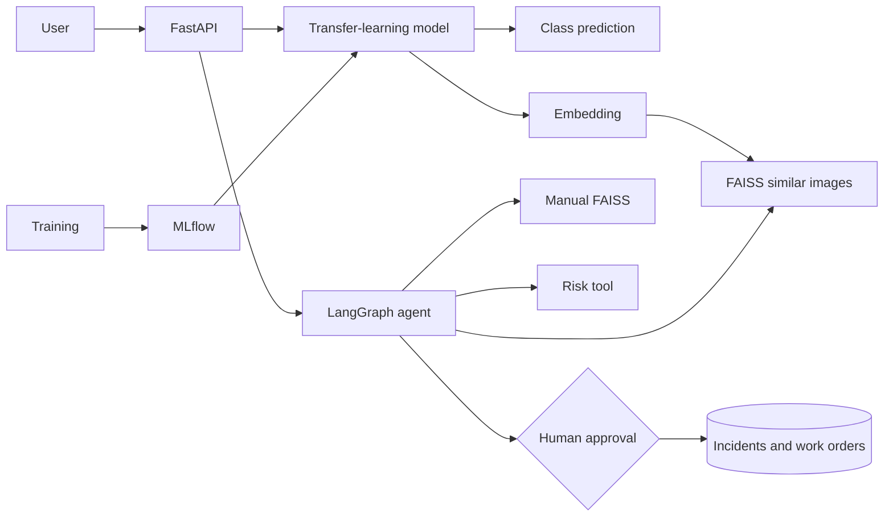

# FactoryLens AI

**Scalable industrial defect intelligence using transfer learning, FAISS similarity search, MLflow experiment tracking and a LangGraph agent with human-approved actions.**

FactoryLens accepts a component image, classifies the visual defect, retrieves similar historical examples, searches a maintenance manual, calculates a deterministic risk score, recommends inspection actions, stores an incident, and optionally creates a work order after explicit human approval.

> Safety: this is a portfolio and research application, not a certified industrial inspection system. A qualified human must verify every result.

## Main features

- PyTorch ResNet-18 transfer learning with a reusable 512-dimensional embedding
- six classes: blowhole, break, crack, fray, free and uneven
- FAISS `Flat`, `HNSW` and `IVF` image indexes
- a second FAISS index for maintenance-manual retrieval
- MLflow parameters, metrics, artifacts, checkpoint lineage and model aliases
- LangGraph workflow with classification, retrieval, manual search, risk, recommendations, persistence and approval nodes
- optional OpenAI evidence narration; all decisions remain deterministic
- FastAPI endpoints, Swagger docs, SQLite/PostgreSQL-compatible persistence
- Streamlit dashboard
- strict official-dataset downloader and validator
- Docker Compose and GitHub Actions

## Dataset

The project uses the **Magnetic Tile Surface Defect Dataset** from the authors' public repository. It contains 1,344 grayscale images: 115 blowhole, 85 break, 57 crack, 32 fray, 103 uneven and 952 defect-free. The 392 defective images have pixel-level masks.

The source images are not repackaged here because the author repository does not expose a standard licence file. The project downloads directly from the original source and validates every image:

```bash
python scripts/download_dataset.py
python scripts/validate_dataset.py
python scripts/prepare_dataset.py
```

Validation produces:

```text
data/reports/dataset_validation.json
data/reports/dataset_manifest.csv
data/processed/split_manifest.csv
```

## Architecture



## Quick start on Windows

Use **Python 3.11**.

```powershell
cd path\to\factorylens-agentic-ai
python -m venv .venv
Set-ExecutionPolicy -Scope Process -ExecutionPolicy Bypass
.venv\Scripts\Activate.ps1
python -m pip install --upgrade pip
pip install -r requirements-dev.txt
Copy-Item .env.example .env
```

Generate the included synthetic smoke-test data and FAISS index:

```powershell
python scripts\generate_demo_data.py
python scripts\build_demo_index.py
```

Start FastAPI:

```powershell
uvicorn app.main:app --reload
```

Open a second terminal:

```powershell
.venv\Scripts\Activate.ps1
streamlit run dashboard.py
```

Open:

- dashboard: `http://localhost:8501`
- API docs: `http://127.0.0.1:8000/docs`
- health: `http://127.0.0.1:8000/api/v1/health`

Demo mode is intentionally labelled **untrained**. It proves the full software workflow but not classification quality.

## Download and prepare the real dataset

```powershell
python scripts\download_dataset.py
python scripts\validate_dataset.py
python scripts\prepare_dataset.py
```

The validator fails if the expected counts, image readability or defect masks do not match. It also records SHA-256 checksums and duplicate groups.

## Train with transfer learning and MLflow

Start the MLflow UI in one terminal:

```powershell
mlflow ui --backend-store-uri sqlite:///mlflow.db --port 5000
```

Open `http://127.0.0.1:5000`, then train:

```powershell
python -m training.train `
  --epochs 12 `
  --batch-size 32 `
  --learning-rate 0.0003
```

For CPU-only development, start with:

```powershell
python -m training.train --epochs 2 --batch-size 8 --freeze-backbone
```

The best checkpoint is saved to:

```text
models/factorylens_resnet18.pt
```

Evaluate it:

```powershell
python -m training.evaluate
```

## Build the real FAISS index

After training:

```powershell
python -m training.build_faiss_index --index-type flat --include-val
```

For a larger collection:

```powershell
python -m training.build_faiss_index --index-type hnsw --include-val
```

Restart the API after changing the checkpoint or index.

## Agent workflow

```text
classify image
  → retrieve similar cases
  → retrieve manual evidence
  → calculate deterministic risk
  → produce recommendations
  → save incident
  → create work order only after explicit human approval
```

The optional LLM only rewrites evidence into a short narrative. Enable it in `.env`:

```env
ENABLE_LLM=true
OPENAI_API_KEY=your_key
OPENAI_MODEL=gpt-5.4-mini
```

The application still works without an API key.

## Important API request

Open Swagger at `/docs`, select `POST /api/v1/analyze`, upload an image, and provide:

```text
machine_id: MOTOR-04
symptoms: overheating and unusual vibration
criticality: high
approve_work_order: false
```

Set `approve_work_order=true` only after reviewing the evidence.

## Run tests

```powershell
pytest --cov=app --cov-report=term-missing
ruff check app scripts training tests
```

## Docker

```powershell
Copy-Item .env.example .env
docker compose up --build
```

Services:

- API: `http://localhost:8000/docs`
- dashboard: `http://localhost:8501`
- MLflow: `http://localhost:5000`

## Scalability

The portfolio version uses SQLite and a local FAISS index. The documented production path uses PostgreSQL, S3/MinIO, Redis, asynchronous workers, GPU inference and immutable HNSW/IVF index snapshots. Run `training/benchmark_faiss.py` to log recall and latency trade-offs into MLflow.

## Repository structure

```text
app/                 FastAPI, model inference, retrieval, database and agent
training/            transfer learning, evaluation and FAISS experiments
scripts/             dataset download, validation, preparation and demo setup
data/                 source manifest, manual and synthetic smoke-test images
docs/                 architecture, API, dataset and scalability notes
tests/                unit and API tests
dashboard.py          Streamlit frontend
docker-compose.yml    API, dashboard and MLflow services
```

## GitHub portfolio checklist

Before publishing results, add:

- MLflow screenshots comparing at least three runs
- confusion matrix and per-class macro F1
- a retrieval example showing five similar images
- Flat versus HNSW/IVF benchmark table
- a two-minute demo video
- limitations, safety and failure examples

## Licence

Project code: MIT. Third-party datasets retain their own terms and are downloaded separately from the original publisher.
