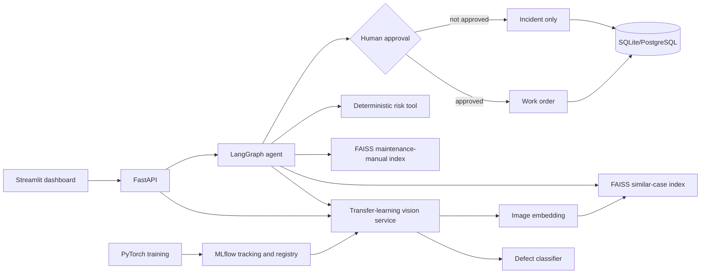

# Architecture

The LLM is optional and may only rewrite the evidence into a concise narrative. Classification, retrieval, risk scoring, approval and database actions remain deterministic and independently testable.
